# TP 2 #

# Exercice 1 #

```python
from sklearn.datasets.mldata import fetch_mldata

mnist = fetch_mldata('MNIST Original', data_home = custom_data_home)
```


*   figure 1

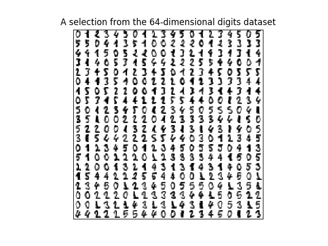

On a ici une représentation sous forme de matrice 20x20 des chiffres choisie aléatoirement dans une base de dimension 64.

*   figure 2

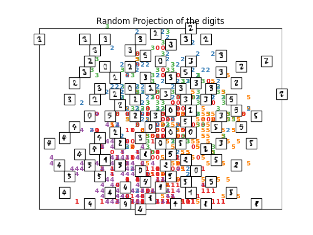

Nous avons ici une projection des points aléatoires des nombres.

*   Figure 3

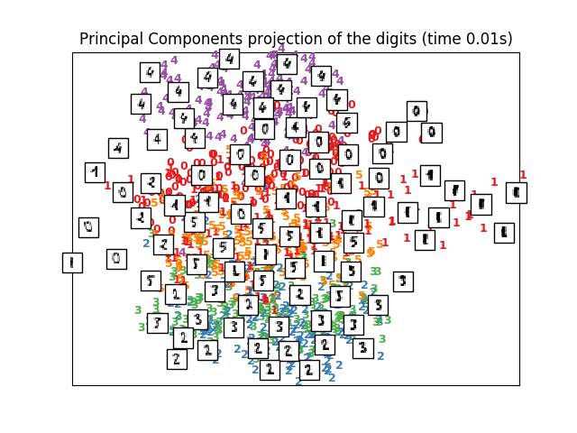

Nous avons ici un ensemble principal des projections des nombres. On remarque que les points sont un peu près réunit par bloc mais pas totalement.

*   Figure 4

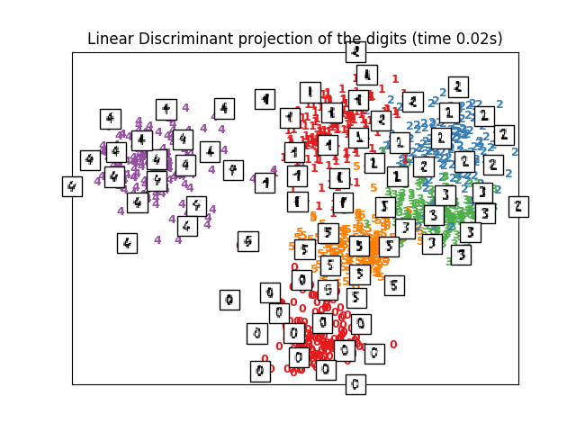

On voit déjà qu'il y a une meilleure représentation des points des nombres, en effet, il sont regroupé par une projection linéaire discriminatoire.

*   Figure 5

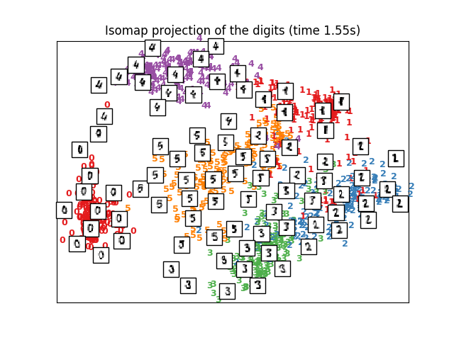

La projection isomap à réussi à regouper les points de nombres mais ce n'est pas la meilleur projection puisqu'il y a des petites quantités des nombres qui sont mélangées avec d'autres.


*   Figure 6 (Intégration linéaire des nombres locaux)

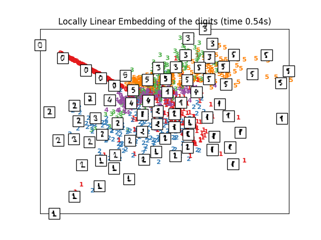

On a ici une intégration linéaire, mais


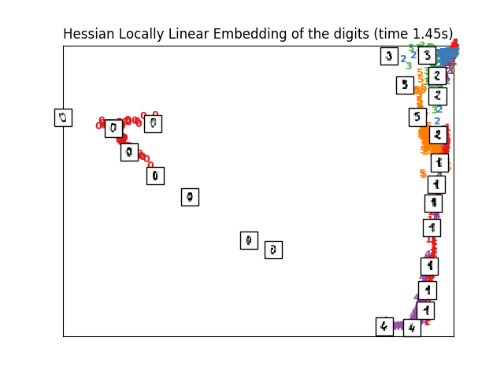


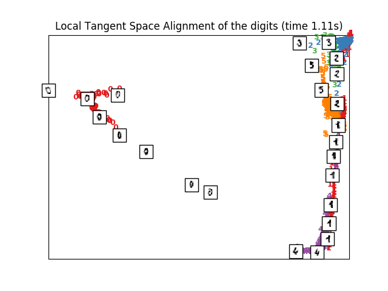


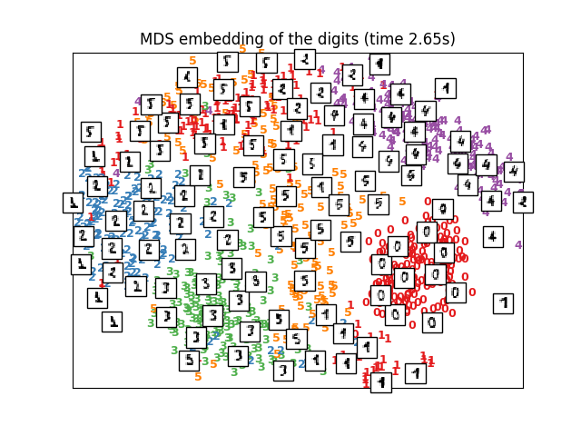


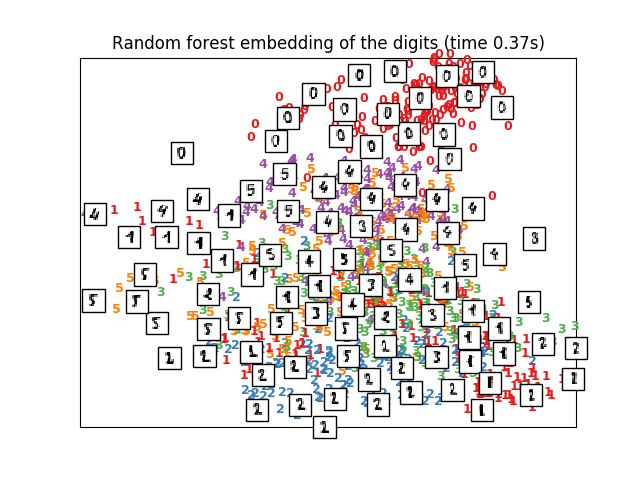


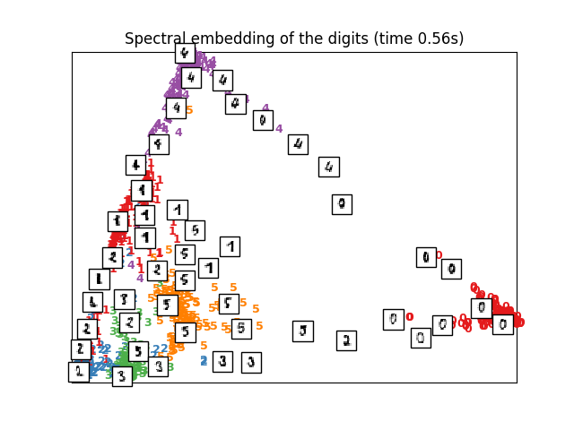


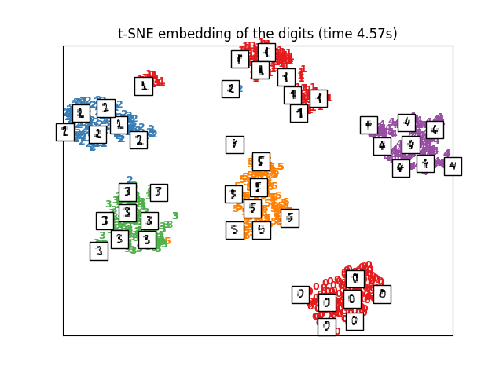


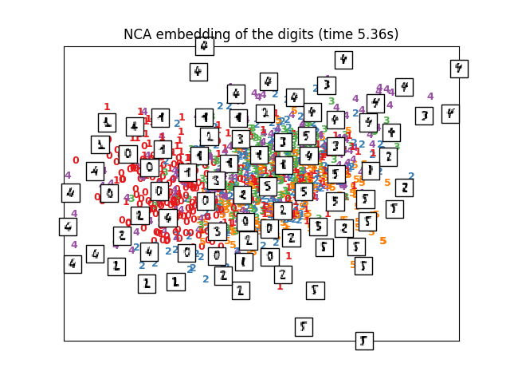

# Exercice 2

1. Download	the	Knime	software	with	all	the	pacakges	v3.0.0
2. Load	the	Iris dataset	using	the	‘File	Reader’	node in	a	knime project	and	tests
use	several	nodes	as	Statistics	and	Plot	to	make	a	small	analysis	of	the	dataset.
* histogramme du noeud "Statistics"


* Nuage de points


3. Compute	 the	 Correlation	 using	 the	 ‘Linear	 Correlation’	 node	 and	 reduce	 the
dimension	 by	 using	 the	 ‘Correlation	 Filter’.	 Plot	 the	 data	 using	 the	 selected
variables.

AF

4. Use	 the	 PCA	 and	 MDS dimensional	 reduction	 techniques	 to	 reduce	 the
dimension	 of	 the	 data	 to	 2	 variables	 and	 plot	 the	 results.	 Make	 an	 analysis
between	the	result	in	question	3	and those	obtained	here.

* Voici le resultat pour le PCA

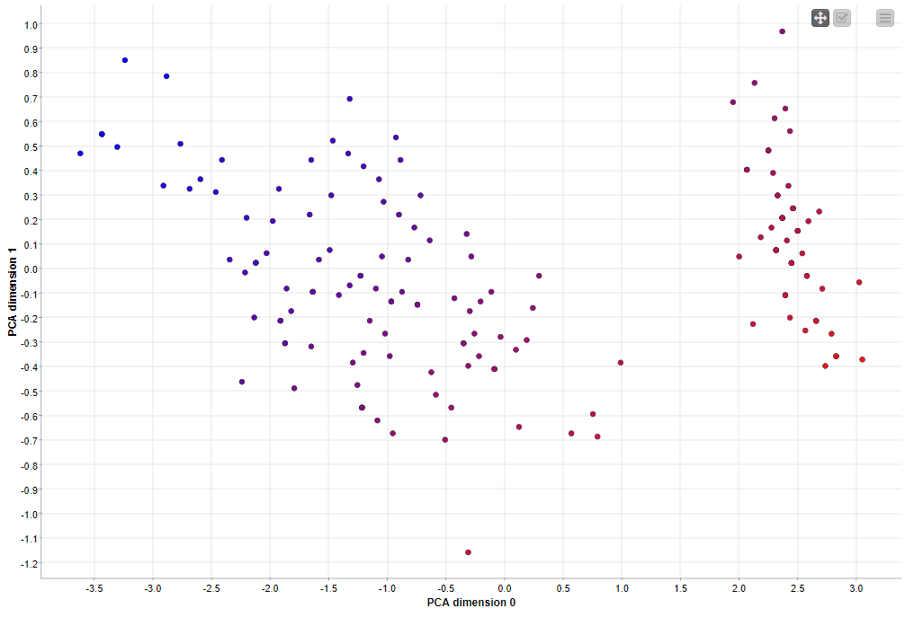

* Voici le resultat pour le MDS

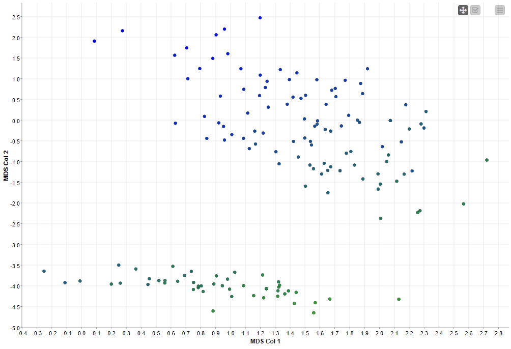

On peut constater que la méthode MDS regroupe mieux certains point (notamment ceux proche de l'Axe X) par rapport a la méthode PCA.
