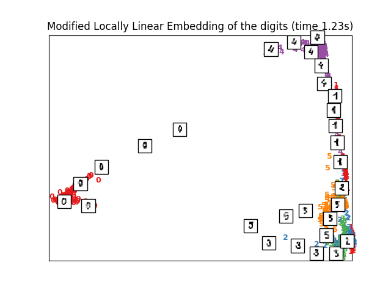

# TP 2 #

# Exercice 1 #

```python
from sklearn.datasets.mldata import fetch_mldata

mnist = fetch_mldata('MNIST Original', data_home = custom_data_home)
```

---

*   figure 1


On a ici une représentation sous forme de matrice 20x20 des chiffres choisie aléatoirement dans une base de dimension 64, de 0 à 5.
---

*   figure 2


Nous avons ici une projection des points aléatoires des nombres. qui ont été généré précédement.

---

*   Figure 3


Nous avons ici un ensemble principal des projections des nombres. On remarque que les points sont un peu près réunit par bloc mais pas totalement.

---

*   Figure 4


On voit déjà qu'il y a une meilleure représentation des points des nombres, en effet, il sont regroupé par une projection linéaire discriminatoire.

---

*   Figure 5


La projection isomap à réussi à regouper les points de nombres mais ce n'est pas la meilleur projection puisqu'il y a des petites quantités des nombres qui sont mélangées avec d'autres.

---

*   Figure 6 (Intégration linéaire des nombres locaux)


On a ici une intégration quii est localement linéaire

---

*   Figure 7



L'encastrement linéaire local (ELL) recherche une projection à plus faible dimension des données qui préserve les distances au sein des quartiers locaux. Il peut être considéré comme une série d'analyses locales en composantes principales qui sont comparées globalement pour trouver le meilleur encastrement non linéaire.

---

*   Figure 8


La différence avec la figure précédente, c'est l'utilisation d'une méthode différente qui est la méthode Hessian

---

*   Figure 9


Pareil que la figure précédente mais avec la méthode LTSA (Local tangent Space Alignement)

---

*   Figure 10


La mise à l'échelle multidimensionnelle (MDS) recherche une représentation des données en basse dimension dans laquelle les distances respectent bien les distances dans l'espace original en haute dimension.

En général, le MDS est une technique utilisée pour analyser les données de similarité ou de dissimilarité. Elle tente de modéliser les données de similarité ou de dissimilarité en tant que distances dans un espace géométrique. Les données peuvent être des cotes de similarité entre objets, des fréquences d'interaction des molécules ou des indices de commerce entre pays.

Il existe deux types d'algorithme MDS : métrique et non métrique. Dans le scikit-learn, la classe MDS met en œuvre les deux. Dans le MDS métrique, la matrice de similarité d'entrée provient d'une métrique (et respecte donc l'inégalité triangulaire), les distances entre deux points de sortie sont alors fixées pour être aussi proches que possible des données de similarité ou de dissimilarité. Dans la version non métrique, les algorithmes tenteront de préserver l'ordre des distances, et donc de rechercher une relation monotone entre les distances dans l'espace intégré et les similitudes/dissimilitudes.

---

*   Figure 11


RandomTreesEmbedding met en œuvre une transformation non supervisée des données. En utilisant une forêt d'arbres complètement aléatoire, RandomTreesEmbedding encode les données par les indices des feuilles dans lesquelles un point de données se retrouve. Cet indice est ensuite codé de manière unidirectionnelle, ce qui conduit à un codage binaire de grande dimension et peu dense. Ce codage peut être calculé très efficacement et peut ensuite être utilisé comme base pour d'autres tâches d'apprentissage. La taille et la rareté du code peuvent être influencées en choisissant le nombre d'arbres et la profondeur maximale par arbre. Pour chaque arbre de l'ensemble, le codage contient une entrée d'un arbre. La taille du codage est au maximum de n_estimateurs * 2 ** max_profondeur, le nombre maximum de feuilles dans la forêt.

Comme les points de données voisins sont plus susceptibles de se trouver dans la même feuille d'un arbre, la transformation effectue une estimation implicite et non paramétrique de la densité.

---

*   Figure 12


L'intégration spectrale est une approche permettant de calculer une intégration non linéaire. Scikit-learn implémente les cartes propres de Laplacian, qui trouvent une représentation à faible dimension des données en utilisant une décomposition spectrale du graphique Laplacian. Le graphe généré peut être considéré comme une approximation discrète du collecteur à faible dimension dans l'espace à haute dimension. La minimisation d'une fonction de coût basée sur le graphique garantit que les points proches les uns des autres sur le collecteur sont cartographiés à proximité les uns des autres dans l'espace de faible dimension, en préservant les distances locales. L'encastrement spectral peut être réalisé avec la fonction spectral_embedding ou sa contrepartie orientée objet SpectralEmbedding.

---

*   Figure 13


t-SNE (TSNE) convertit les affinités des points de données en probabilités. Les affinités dans l'espace original sont représentées par des probabilités conjointes gaussiennes et les affinités dans l'espace intégré sont représentées par les distributions t de Student. Cela permet à l'ETS d'être particulièrement sensible à la structure locale et présente quelques autres avantages par rapport aux techniques existantes :

*    Révéler la structure à plusieurs échelles sur une seule carte

*    Révéler les données qui se trouvent dans des multiples, différents, multiples ou clusters

*    Réduire la tendance à regrouper les points au centre

Alors que l'Isomap, le LLE et les variantes sont les mieux adaptés pour déplier un seul collecteur continu de faible dimension, le t-SNE se concentrera sur la structure locale des données et tendra à extraire des groupes locaux d'échantillons groupés comme le montre l'exemple de la courbe en S. Cette capacité à regrouper des échantillons en fonction de la structure locale pourrait être utile pour démêler visuellement un ensemble de données qui comprend plusieurs manifolds à la fois, comme c'est le cas dans l'ensemble de données numériques.

La divergence de Kullback-Leibler (KL) des probabilités d'articulation dans l'espace original et l'espace encastré sera minimisée par la descente de gradient. Notez que la divergence KL n'est pas convexe, c'est-à-dire que des redémarrages multiples avec des initialisations différentes se retrouveront dans les minima locaux de la divergence KL. Par conséquent, il est parfois utile d'essayer différentes graines et de sélectionner l'encastrement avec la divergence KL la plus faible.

Les inconvénients de l'utilisation de l'ESN-T sont en gros les suivants

*     t-SNE est coûteux en termes de calcul et peut prendre plusieurs heures pour des ensembles de données de plusieurs millions d'échantillons, alors que l'ACP se termine en quelques secondes ou minutes

*    La méthode t-SNE de Barnes-Hut est limitée à des encastrements en deux ou trois dimensions.

*    L'algorithme est stochastique et des redémarrages multiples avec des graines différentes peuvent produire des encastrements différents. Cependant, il est parfaitement légitime de choisir l'encastrement avec le moins d'erreur possible.

*    La structure globale n'est pas explicitement préservée. Ce problème est atténué par l'initialisation des points avec l'ACP (en utilisant `init='pca'`).

---

*   Figure 14


L'analyse des composantes du voisinage (NCA, NeighborhoodComponentsAnalysis) est un algorithme d'apprentissage de la métrique de la distance qui vise à améliorer la précision de la classification des plus proches voisins par rapport à la distance euclidienne standard. L'algorithme maximise directement une variante stochastique du score des k-voisins les plus proches (KNN) sur l'ensemble d'apprentissage. Il peut également apprendre une projection linéaire à basse dimension des données qui peut être utilisée pour la visualisation des données et la classification rapide.

---

# Exercice 2

1. Download	the	Knime	software	with	all	the	pacakges	v3.0.0
2. Load	the	Iris dataset	using	the	‘File	Reader’	node in	a	knime project	and	tests
use	several	nodes	as	Statistics	and	Plot	to	make	a	small	analysis	of	the	dataset.
* histogramme du noeud "Statistics"


* Nuage de points


3. Compute	 the	 Correlation	 using	 the	 ‘Linear	 Correlation’	 node	 and	 reduce	 the
dimension	 by	 using	 the	 ‘Correlation	 Filter’.	 Plot	 the	 data	 using	 the	 selected
variables.

AF

4. Use	 the	 PCA	 and	 MDS dimensional	 reduction	 techniques	 to	 reduce	 the
dimension	 of	 the	 data	 to	 2	 variables	 and	 plot	 the	 results.	 Make	 an	 analysis
between	the	result	in	question	3	and those	obtained	here.

* Voici le resultat pour le PCA


* Voici le resultat pour le MDS


On peut constater que la méthode MDS regroupe mieux certains point (notamment ceux proche de l'Axe X) par rapport a la méthode PCA.
