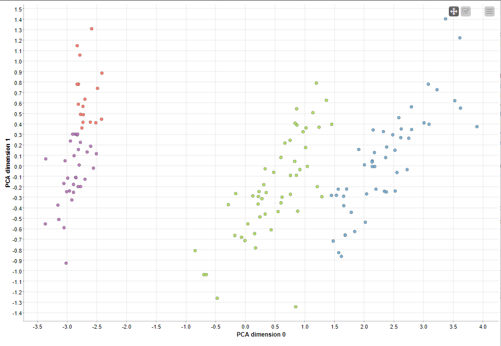

# TP 3 Classification non supervisée avec l’approche k-means #

## Exercice 1 ##

*   Ouvrez le module «k-means» sur Knime et étudiez toutes les options proposées.

Ce nœud produit les centres de clusters pour un nombre prédéfini de clusters (pas de nombre dynamique de clusters). K-means effectue une mise en cluster rigoureuse qui attribue un vecteur de données à exactement une cluster. L'algorithme se termine lorsque les affectations de clusters ne changent plus.

L'algorithme de mise en cluster utilise la distance Euclidienne sur les attributs sélectionnés. Les données ne sont pas normalisées par le nœud

Nombre de clusters : Le nombre de clusters (centres de clusters) à créer.

Centroid initialisation :

*   First k row : Initialise les centroïdes en utilisant les premières lignes du tableau d'entrée.
*   Random initialization : initialise les centroïdes à l'aide des lignes aléatoires du tableau d'entrée.
*   La case Use static random seed permet d'avoir des résultats qui sont reproductibles.

Max number of iterations : Le nombre maximum d'itérations après lequel l'algorithme se termine s'il n'a pas trouvé de solution stable auparavant.

Enable Hilite Mapping : l'hilitage d'une ligne du cluster (2ème sortie) hilitera toutes les lignes de ce cluster dans le tableau d'entrée et le tableau de la 1ère sortie.

## Exercice 2 ##

Nous proposons un scenario suivant, avec une application du PCA et son affichage par scatterplot.

---

*   Cluster 3

Nous obtenons alors le résultat suivant avec la base d'iris.

Nous obtenons alors le résultat suivant avec la base waveform

Nous remarquons que l'on obtient 3 clusters qui ne se chevauchent pas après le traitement algorithme du cluster k-means.

---

*   Cluster 4

Nous obtenons alors le résultat suivant avec la base d'iris.

Nous obtenons alors le résultat suivant avec la base waveform

Nous remarquons que l'on obtient 4 clusters qui ne se chevauchent pas après le traitement algorithme du cluster k-means. Avec un PCA de 2 pour la représentation en scatterplot.

---

*   Cluster 5

Nous obtenons alors le résultat suivant avec la base d'iris.

Nous obtenons alors le résultat suivant avec la base waveform

Nous remarquons que l'on obtient 5 clusters qui ne se chevauchent pas après le traitement algorithme du cluster k-means.

En ce qui concerne pour la base de données d'iris, on est limité à 4 cluster.

## Exercice 3 ##

Visualisez les données initiale set ensuite visualisez les résultats du clustering.Déterminez les centres des clusters résultants. Projetez les barycentres de chaque cluster sur les résultats obtenus.

Pour la base de données iris, on a les données initiales suivantes.

---

Méthode clustering :

