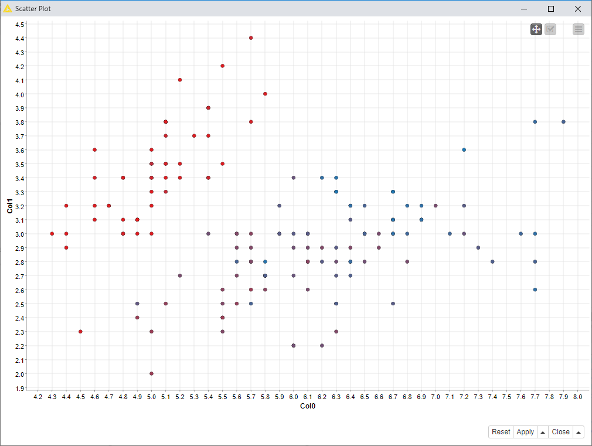
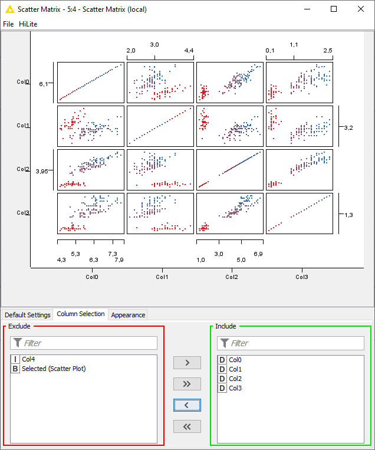
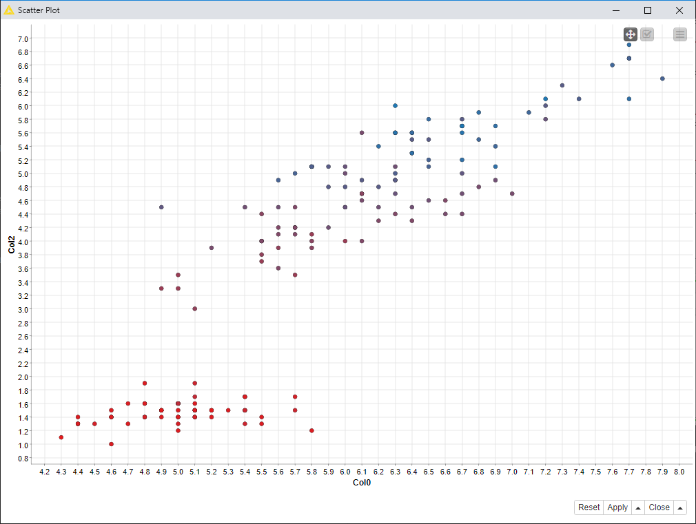
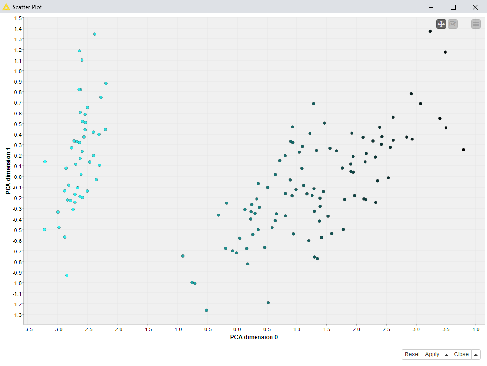
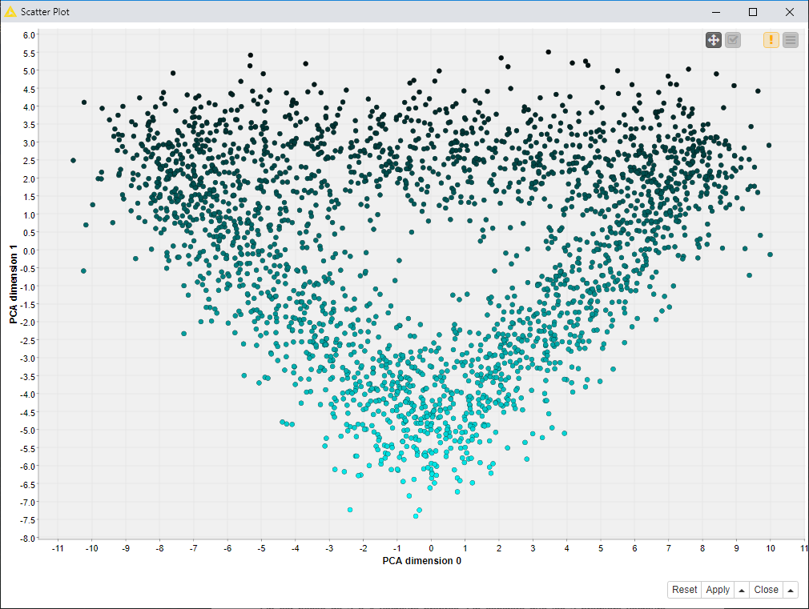
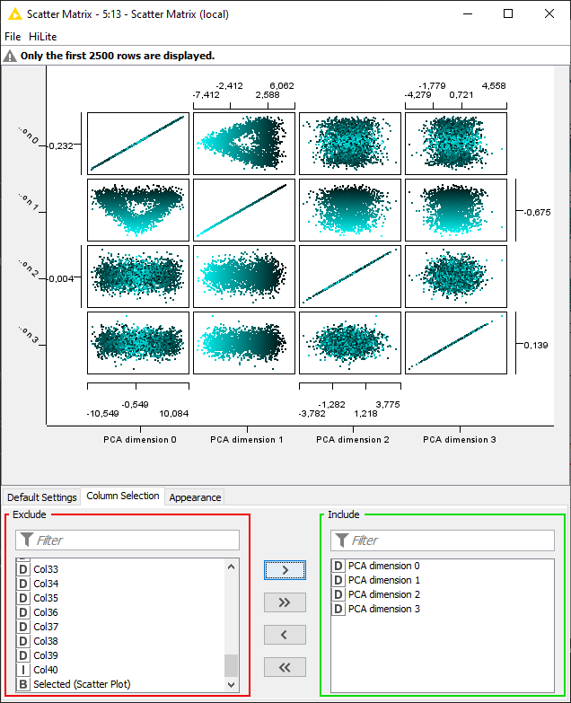
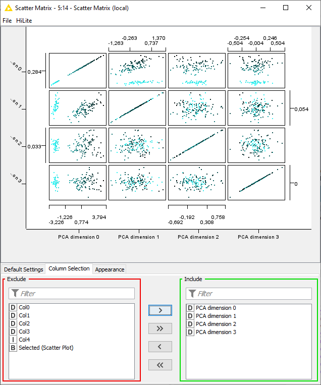
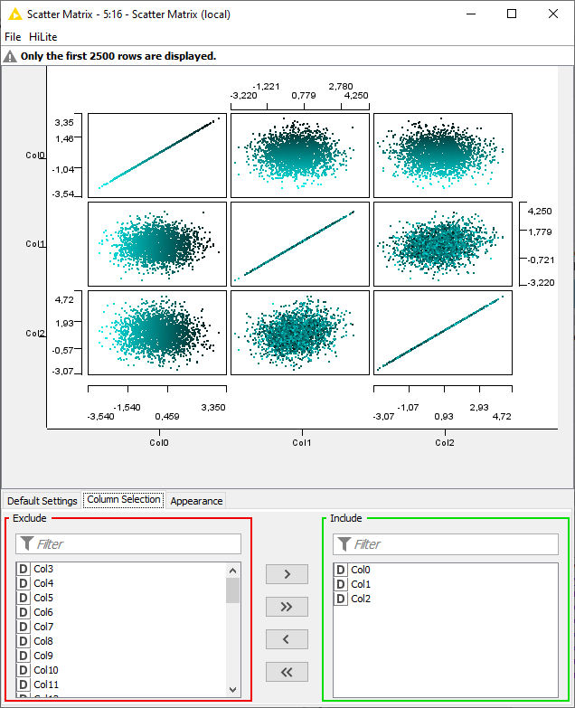

# TP 4

# Exercice 1

Le PCA permet de faire une bijection des données sur une paire pour pouvoir les
visualiser en 2D (dimension to reduce: 2, si besoin, exclure les données non
pertinentes).

# Exercice 2

Voici ce que nous obtenons avec le premier scatter plot

Afin d'obtenir toutes les combinaison de paires pour le scatter plot nous devons utiliser le noeud "Scatter Matrix" ce qui nous permet d'obtenir les graphes suivant :

On remmarque que c'est la paire Col0:Col2 qui est la meilleure, car dans cette vue les valeurs sont mieux séparées que dans les autres vues.

# Exercice 3

a) On utilise un **File Reader** afin de lire un data set puis on le relie a un noeud **PCA** afin de reduire le data set à deux dimensions

Afin de faciliter la visualisation, on utilise **Color Manager** relié avec **PCA** pour coloriser les données.

Enfin on utilisera **Scatter Plot** afin de générer un nuage de point et visualiser les données.

b)

Nous constatons que les données sont mieux séparées par classes. Nous distinguons bien les 3 classes (bleu clair / bleu foncé / noir). La méthode PCA permet donc d’avoir chaque type d’iris mieux séparé et groupé.

c.d.e)

* Ci-dessus le nuage de point du PCA du data set **Waveform** a deux dimensions.

* Ci-dessus la matrice des nuages de point du PCA du data set **Waveform** a quatres dimensions.

* Ci-dessus la matrice des nuages de point du PCA du data set **Iris** a quatres dimensions.

# Exercice 4

a) Voici toutes les combinaisons de nuage de point que nous pouvons obtenir a partir du data set **Waveform** :

Nous remarquons que les classes sont toutes melangées et par conséquent aucune analyse n'est possible.

b) (cf les figures de l'exercice précédent)

Nous constatons qu'en utilisant un PCA il est plus facile de distinguer les classes de données, c'est donc une méthode a favoriser pour la lecture de données.
